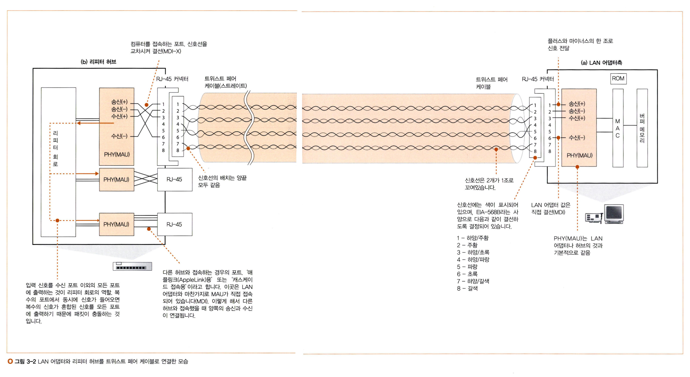
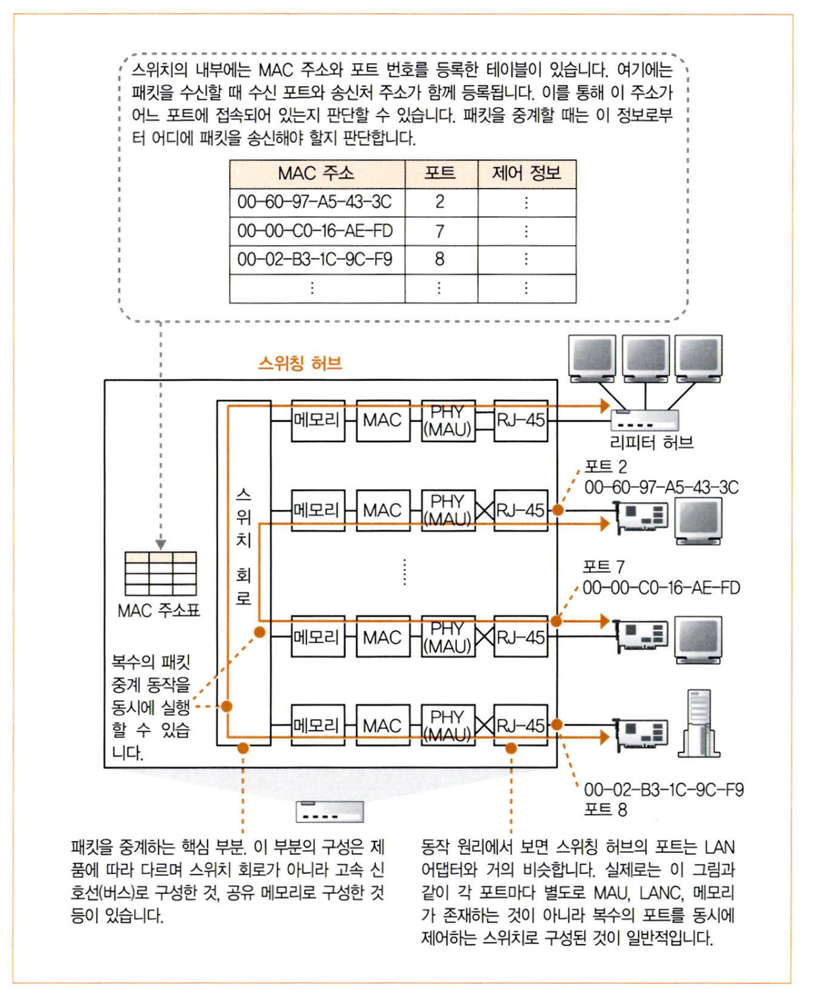

# 3. 케이블의 앞은 LAN 기기였다.
## 3-1. 케이블과 리피터, 허브 속을 신호가 흘러간다.
### 1. 하나하나의 패킷이 독립된 것으로 동작한다.
- 리피터 허브, 스위치 허브, 라우터 등의 기기는 자신이 속한 계층의 제어 정보 이 외에는 모두 다 데이터로 간주한다.
    - **리피터 허브**(Repeater Hub)는 L1 기기로 수신된 신호를 단순하게 브로드캐스트 한다.
    - **스위치 허브**(Switch Hub)는 L2 기기로 MAC 주소를 이용해 다음 기기로 데이터를 보낸다.
    - **라우터**(Router)는 L3 기기로 IP 주소를 이용해 다음 기기로 데이터를 보낸다.

 요즘은 라우터, 스위칭 허브, 리피터 허브의 기능이 모두 결합된 기기를 쓴다. 이를 공유기라고 부르지만 정식 명칭은 AP(Access Point)다. 

### 2. LAN 케이블은 신호를 약화시키지 않는 것이 핵심이다.
- 송신된 신호는 전자파의 성질과 잡음으로 인해 변형되어 수신했을 때는 원래 신호와 달라진다.
- 전기 신호의 주파수에 따라 전자가 진동하며 전자기파가 발생한다.*
    - 고주파일수록 방출되는 전자기파가 높아지기 때문에 그만큼 에너지의 손실이 생긴다. 그래서 케이블이 길수록 신호가 약해진다.

* 자세한 것은 [맥스웰 방정식](https://namu.wiki/w/%EB%A7%A5%EC%8A%A4%EC%9B%B0%20%EB%B0%A9%EC%A0%95%EC%8B%9D)을 참고하라.

변형된 신호로 인해 0과 1을 잘못 판독할 수 있어 통신 오류가 일어날 수 있다.

### 3. '꼼'은 잡음을 방지하기 위한 방법이다.
- 전자파는 금속 등의 전기가 잘 통하는 도체에 닿으면 금속 표면의 전류로 변화되고, 이는 케이블에 흐르는 전기 신호에 영향을 준다. 즉, 잡음이 생긴다.
- 케이블은 케이블 외부와 케이블 내부에서 발생하는 전자파에 영향을 받는다.
    - 전자 기기에서 누설되는 전자파(외부)
    - 인접한 신호선에서 누설되는 전자파(내부)
- 잡음을 상쇄하기 위해 케이블을 꼰 것이다. 이 외에도 신호선 사이의 거리를 유지하기 위해 **구분판**을 넣거나, 금속성의 **실드**(Shield)라는 피복을 입히는 등의 방법을 사용한다.
    - [앙페르 법칙](http://www.ktword.co.kr/test/view/view.php?m_temp1=4395)에 의해 외부에서 발생한 전자파의 오른쪽 방향으로 유도 전류가 생기는데, 이를 신호선을 꼬아 상쇄한다.
    - 내부에 흐르는 전류로 인한 전자파*는 꼬는 간격을 달리해 플러스와 마이너스의 균형을 잡아 상쇄한다.

* 크로스토크(Crosstalk)라고 한다.

케이블을 꼬아 잡음을 상쇄한다.

트위스트 페어 케이블 카테고리

### 4. 리피터 허브는 연결되어 있는 전체 케이블에 신호를 송신한다.
- 리피터 허브는 들어온 신호를 연결된 케이블 전부에 다시 송신한다.
    - 제품 중에는 신호의 파형을 다듬고 오류를 억제하는 것도 있다.
- 신호를 올바르게 송∙수신 하려면 한쪽의 송신이 상대의 수신에 연결되어야 한다.
    - MDI(Media Dependent Interface) 커넥터와 MDI/X(MDI-Crossover) 커넥터를 연결한다.
    - 크로스 케이블을 이용하여 연결한다.

리피터 허브의 내부

## 3-2. 스위칭 허브의 패킷 중계 동작
### 1. 스위칭 허브는 주소 테이블로 중계한다.
- 스위칭 허브는 수신한 이더넷 프레임을 MAC 주소 테이블을 참고해 목적지로 송신한다.
    1. 수신한 이더넷 프레임에 오류가 없는지 FCS를 대조한다.
    2. 오류가 없다면 버퍼 메모리에 저장한다.
    3. MAC 주소 테이블을 참고해 스위치 회로를 경유하여 목적지로 송신한다.

스위치 허브의 원리

- 스위칭 허브에서 커넥터와 안쪽에 있는 회로 부분을 **포트**(Port)라 한다.
    - PC의 LAN 어댑터와 거의 같지만*, MAC 주소가 할당되어 있지 않다.**

* 그래서 프로미스큐어스 모드로 동작하면 PC를 스위칭 허브처럼 사용할 수 있다.
** 하지만 보통 기기를 원격으로 관리하기 위해 프로세서를 내장한 후 MAC 주소와 IP 주소를 할당한다.

스위치 회로의 개념

### 2. MAC 주소 테이블을 등록 및 갱신한다.
- MAC 주소 테이블은 자동으로 관리된다.*
    - 신규 MAC 주소의 등록은 이더넷 프레임을 수신한 후 송신처 MAC 주소를 조사해 입력 포트와 묶어서 저장한다.
    - MAC 주소의 삭제는 일정 시간(보통 몇 분)이 지나면 자동으로 삭제된다. 

* 고급 기종은 수동으로 관리할 수 있다.

### 3. 예외적인 동작
- 수신한 포트와 송신하는 포트가 같은 경우 패킷을 중계하지 않고 폐기한다.

목적지에 같은 패킷이 두 번 도착하지 않게 한다.

- MAC 주소 테이블에 목적지 MAC 주소가 없는 경우 브로드캐스트한다.

### 4. 전이중 모드에서 송신과 수신을 동시에 실행한다.
- 스위치 허브는 전이중 모드를 지원한다. 즉, 양방향 통신이 가능하다.

스위치 허브는 전이중 모드로 동작할 수 있다.

### 5. 최적의 전송 속도로 보내는 자동 조정
- **자동 조정**(Auto Negotiation)이란 상대방의 동작 모드와 전송 속도를 검출해 자동으로 전환하는 것이다.
- 이더넷은 링크 펄스를 흘려 상대가 올바르게 작동하는지, 케이블이 단선되지 않았는지 등의 사항을 확인한다.
    - 커넥터 주변에 있는 초록 LED 표시등이 켜져있다면 PHY(MAU) 회로와 케이블에 이상이 없는 것이다.*
- 자동 조정은 특정 패턴의 링크 펄스를 이용해 지원 가능한 모드와 전송 속도를 서로 통지하고, 그 중 최적의 조합을 선택한다.

* MAC 회로, 버퍼 메모리, 버스 신호선의 이상은 판단할 수 없다.

자동 조정을 위해 서로 특수한 패턴의 링크 펄스를 보낸다.

### 6. 스위칭 허브는 복수의 중계 동작을 동시에 실행한다.
- 리피터 허브는 들어온 신호를 모든 포트에 전송하기에 패킷의 충돌을 방지하기 위해 복수의 신호를 동시에 전송할 수 없다. 반면, 스위치 허브는 목적지에 해당하는 포트로만 신호를 전송하기에 복수의 신호를 동시에 전송할 수 있다.

## 3-3. 라우터의 패킷 중계 동작
- 스위칭 허브는 이더넷의 구조를 기초로 하여 만든 기기(L2)
- 라우터는 IP 개념을 기초로 만듦(L3)

## 3-4. 라우터의 부가 기능
- 주소 변환 기능(NAT)
- 패킷 필터링

# 참고자료
- https://ko.wikipedia.org/wiki/%EB%A7%A5%EC%8A%A4%EC%9B%B0_%EB%B0%A9%EC%A0%95%EC%8B%9D
- http://www.rfdh.com/bas_rf/emwave.htm
- http://www.ktword.co.kr/test/view/view.php?m_temp1=4395
- https://www.firewall.cx/networking/network-cabling/network-cabling-utp.html